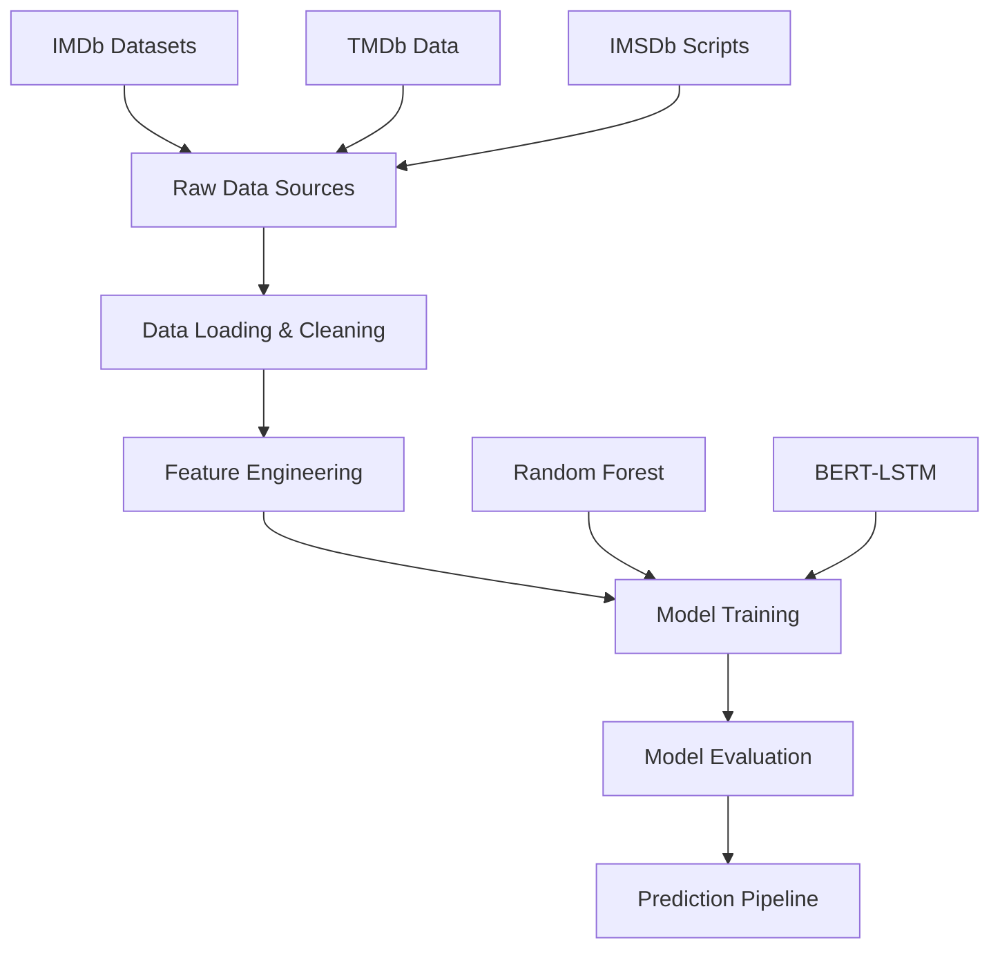

# Architecture Overview

This document provides a comprehensive overview of the Movie Success Predictor system architecture, including pipeline flow, component interactions, and design decisions.

## System Architecture

### High-Level Overview



### Pipeline Components

#### 1. Data Layer

- **Raw Data Sources**: IMDb, TMDb, IMSDb datasets
- **Data Loading**: Merging multiple data sources on common identifiers
- **Data Cleaning**: Handling missing values, standardization

#### 2. Feature Engineering Layer

- **Metadata Features**: Numeric and categorical feature extraction
- **NLP Features**: Script processing with BERT tokenization
- **Feature Transformation**: One-hot encoding, normalization

#### 3. Model Layer

- **Random Forest**: Metadata-based classification
- **BERT-LSTM**: Sequential script analysis
- **Model Persistence**: Serialization and storage

#### 4. Evaluation Layer

- **Metrics Calculation**: ROC-AUC, precision, recall, F1-score
- **Performance Analysis**: Feature importance, model comparison

## Component Architecture

### Core Modules

#### config.py

- **Purpose**: Centralized configuration management
- **Features**: JSON-based configuration, path management
- **Dependencies**: None

```python
# Configuration structure
{
    "clean_data_path": "../data/cleaned",
    "processed_data_path": "../data/processed",
    "models_path": "../models",
    "random_seed": 42,
    "test_size": 0.2
}
```

#### data_loader.py

- **Purpose**: Data loading and initial merging
- **Input**: Cleaned CSV files from multiple sources
- **Output**: Merged DataFrame with common identifiers
- **Key Functions**:
  - `load_data()`: Merge IMDb and TMDb datasets
  - Data validation and consistency checks

#### feature_engineer.py

- **Purpose**: Transform raw data into modeling features
- **Input**: Merged raw DataFrame
- **Output**: Engineered feature matrix
- **Key Operations**:
  - Genre one-hot encoding using pandas.get_dummies()
  - Numeric feature selection and validation
  - Binary target creation based on median rating

#### script_features.py

- **Purpose**: NLP processing of movie scripts
- **Input**: Text files in scripts directory
- **Output**: NLP feature matrix
- **Key Components**:
  - BERT tokenization (max length 512)
  - Sentiment analysis using TextBlob
  - Readability scoring using textstat

#### model_trainer.py

- **Purpose**: Model training and evaluation
- **Input**: Feature matrices from previous steps
- **Output**: Trained models and evaluation metrics
- **Features**:
  - Feature merging from multiple sources
  - Train/test splitting with stratification
  - Model persistence using joblib

### Data Flow Architecture

#### 1. Data Ingestion Flow

```
IMDb Basics CSV ──┐
                  ├── data_loader.py ──> Merged DataFrame
IMDb Ratings CSV ─┤
                  │
TMDb Data CSV ────┘
```

#### 2. Feature Engineering Flow

```
Merged DataFrame ──> feature_engineer.py ──> Base Features
                                        ┌─> Genre Features (One-hot)
                                        ├─> Numeric Features
                                        └─> Target Variable

Script Files ──> script_features.py ──> NLP Features
                                    ┌─> BERT Tokens
                                    ├─> Sentiment Scores
                                    └─> Readability Metrics
```

#### 3. Model Training Flow

```
Base Features ──┐
                ├── Feature Merge ──> model_trainer.py ──> Trained Models
NLP Features ───┘                                    ┌─> Random Forest
                                                     └─> Evaluation Metrics
```

## Design Decisions

### 1. Modular Architecture

**Decision**: Separate modules for each pipeline stage
**Rationale**:

- Independent testing and development
- Easier maintenance and debugging
- Flexible pipeline execution (run individual components)

### 2. Configuration Management

**Decision**: JSON-based configuration with centralized loading
**Rationale**:

- Easy modification without code changes
- Version control of configuration
- Environment-specific settings

### 3. Feature Engineering Strategy

**Decision**: Separate numeric and NLP feature processing
**Rationale**:

- Different processing requirements
- Optional script processing (not all movies have scripts)
- Scalable feature addition

### 4. Model Architecture

**Decision**: Dual-model approach (Random Forest + BERT-LSTM)
**Rationale**:

- Random Forest: Interpretable metadata analysis
- BERT-LSTM: Advanced NLP capabilities
- Complementary strengths for comprehensive prediction

## Performance Considerations

### Memory Management

- Streaming data processing for large datasets
- Feature matrix optimization
- Model checkpointing for long training runs

### Scalability

- Modular design allows horizontal scaling
- Independent feature processing
- Batch processing capabilities for scripts

### Maintainability

- Clear separation of concerns
- Comprehensive error handling
- Extensive logging and debugging support

## Error Handling Strategy

### Data Validation

- Schema validation for input data
- Missing value detection and handling
- Data type consistency checks

### Pipeline Robustness

- Graceful degradation (missing scripts)
- Checkpoint recovery for interrupted runs
- Comprehensive error logging

### Model Validation

- Feature distribution checks
- Model convergence monitoring
- Performance threshold validation

## Future Architecture Enhancements

### Planned Improvements

1. **Real-time Prediction API**: REST API for real-time predictions
2. **Model Versioning**: MLflow integration for model lifecycle management
3. **Distributed Processing**: Spark integration for large-scale processing
4. **Advanced NLP**: Transformer fine-tuning for domain-specific tasks

### Scalability Roadmap

1. **Containerization**: Docker deployment for consistent environments
2. **Cloud Integration**: AWS/GCP deployment with auto-scaling
3. **Pipeline Orchestration**: Apache Airflow for workflow management
4. **Monitoring**: Real-time performance and data drift monitoring
